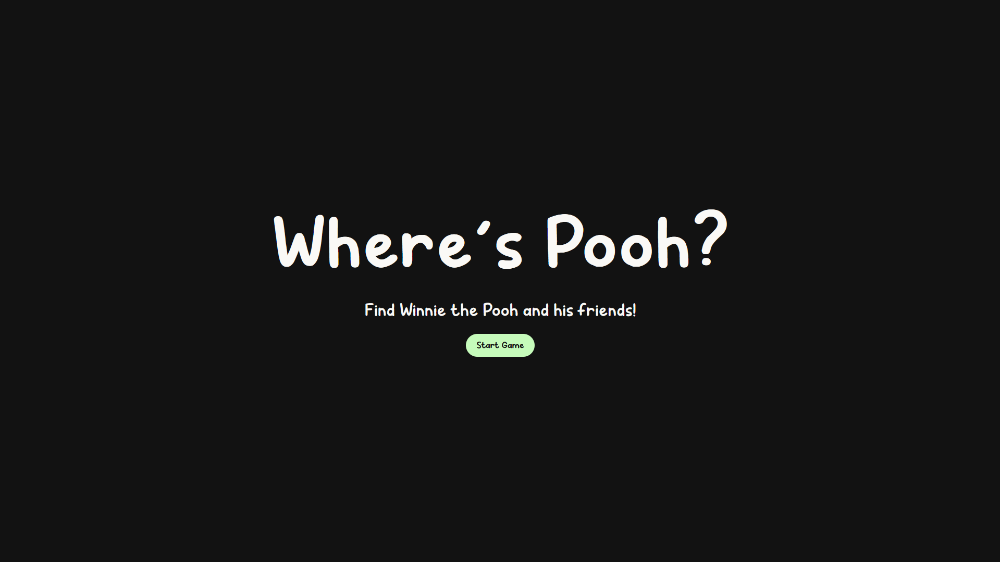
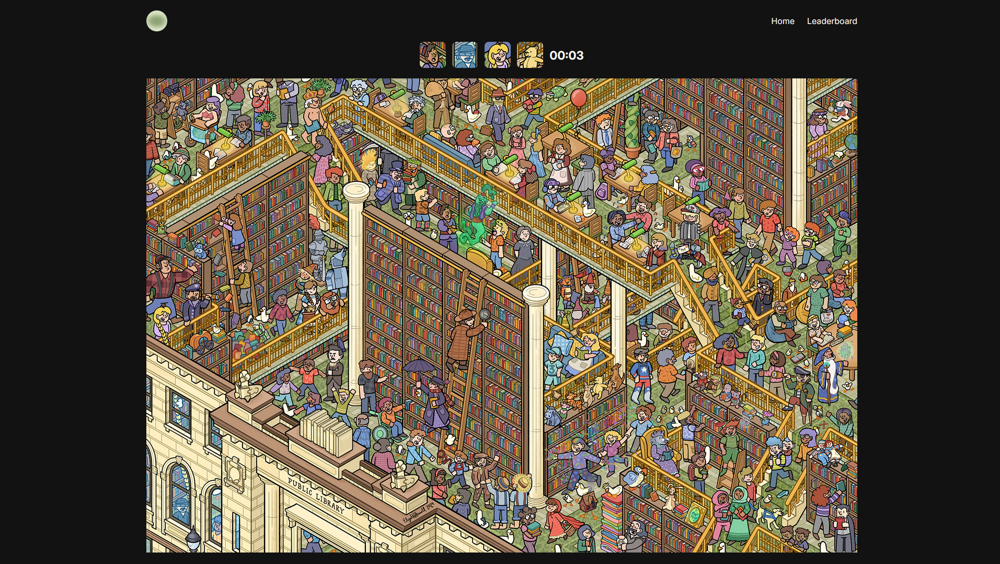

<h1 align="center">
  Where's Pooh
  <h4 align="center">Find Winnie the Pooh and his friends!</h4>
</h1>

## 🚀 Live Site

The live site can be viewed [here](https://wheres-pooh.vercel.app/).

## 📼 Demo

## 📝 Project Description

The [project specification](https://www.theodinproject.com/lessons/nodejs-where-s-waldo-a-photo-tagging-app) describes the general instructions in doing the project.
